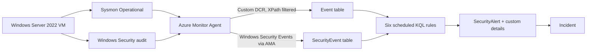

# Microsoft Sentinel Detection Validation Lab

**Six KQL detections, each tested with a positive case and a control, and each alert traced back to the exact Windows event that caused it.**

`Windows Server 2022` · `Sysmon` · `Windows Security auditing` · `Azure Monitor Agent` · `Microsoft Sentinel` · `KQL` · `PowerShell` · `Python`

---

## The problem this solves

A detection query that returns rows hasn't been validated. Several stages sit between running a test and seeing an alert:

```
scenario runs → endpoint logs it → AMA ingests it → query matches it → scheduled rule alerts → incident is created
```

Any of these stages can fail without an error. A missing alert could mean the detector is wrong, but it could also mean ingestion is slow, the event fell outside the query window, or the alert's fields were mapped incorrectly. This lab checks each stage separately. Every alert carries a deterministic **EventKey**, a SHA-256 hash of the source record's fields, which proves that the alert came from the specific event I generated and not from an older event that happens to match the same rule.

## Featured detection: new account → local Administrators

[**Read the full case study →**](docs/case-study-account-chain.md)

DVL-006 correlates Windows Security **4720** (account created) with **4732** (member added to a group). It fires when the same account on the same host is added to local Administrators within ten minutes of being created.

The join is easy to get wrong. On 4720, `TargetSid` is the **new account**. On 4732, `TargetSid` is the **group**, and the account is in `MemberSid`. The rule normalizes both to `AccountSid` before joining, and it enforces event order.

The alert includes both source event keys plus a composite key. All three matched the source records:

[](docs/case-study-account-chain.md)

## Architecture



There are two data collection rules, each with its own XPath filter:

- **Sysmon** event IDs 1, 11, 13, and 16 go to `Event`, where the rules parse the XML.
- **Security** event IDs 4720, 4726, 4732, and 4733 go to `SecurityEvent`.

[Architecture and event-key design →](docs/architecture.md)

## Detections

| Rule | Detects | MITRE ATT&CK | Source | Control case (must not alert) |
|---|---|---|---|---|
| [DVL-001](queries/deployed/DVL-001.kql) | PowerShell `-enc` / `-EncodedCommand` | T1059.001 | Sysmon 1 | Plain `-Command` |
| [DVL-002](queries/deployed/DVL-002.kql) | `schtasks.exe /Create` | T1053.005 | Sysmon 1 | `schtasks /Query` |
| [DVL-003](queries/deployed/DVL-003.kql) | Account added to local Administrators (`S-1-5-32-544`) | T1098.007 | Security 4732 | Added to Users (`S-1-5-32-545`) |
| [DVL-004](queries/deployed/DVL-004.kql) | Value set under `CurrentVersion\Run` | T1547.001 | Sysmon 13 | Write to a non-autorun key |
| [DVL-005](queries/deployed/DVL-005.kql) | `certutil.exe -decode` | T1140 † | Sysmon 1 | `certutil -hashfile` |
| [DVL-006](queries/deployed/DVL-006.kql) | New account added to Administrators within 10 min | T1136.001, T1098.007 | Security 4720 + 4732 | Account created, never added |

† Intended mapping. It isn't set on the deployed rule yet (see [Next iteration](#next-iteration)).

The controls make sure each rule matches the **behavior**, not just the executable name. For example, `certutil -hashfile` produces a real process event that DVL-005 has to ignore. Because that event still reaches the workspace, a non-match proves the logic works. It can't be explained away as missing data.

## Results

| | |
|---|---|
| Rules with confirmed alerts traced to their source event | **6 / 6** |
| Distinct test cases (6 positive, 6 control) | **12** |
| Completed test runs, with execution and cleanup recorded | **23** |
| Evidence-file checksums matching their run reports | **137 / 137** |
| Offline unit tests for the validation tool | **16 passing** |

[Evidence gallery](docs/evidence/README.md) · [Full validation record](docs/validation.md)

## Debugging highlights

**The alert existed, but the lookup couldn't find it.** DVL-005 was firing correctly, but searching for alerts by EventKey returned nothing. Inspecting the alert's custom details showed that `EventID` had been mapped where `EventKey` belonged. I fixed the mapping without changing the detection logic and confirmed the fix with a fresh test run. [Before and after →](docs/troubleshooting.md)

**An empty search doesn't mean the detector failed.** I traced early "missing" results to the rolling query window, ingestion delay (one registry event took about 21 minutes to arrive), and searches run before the scheduler had fired. I treated each of these as its own possible cause instead of repeatedly resetting the rules.

**The test harness hashed its own output.** The first version of the checksum step wrote its CSV into the directory it was enumerating, so it tried to hash the file it was writing. The fixed harness builds the file list first and excludes the report.

## Next iteration

These are known gaps from reviewing the baseline. Each one is a planned change.

- **Duplicate alerts.** A 5-minute schedule with a 30-minute lookback evaluates each event up to six times. The single-table rules (DVL-001 to 005) will move to near-real-time (NRT) rules, which work on ingestion time. Alert grouping will also be turned on.
- **Entity mapping.** Map Host, Account, Process, and Registry entities so that incident grouping, the investigation graph, and entity-based automation work.
- **Shared parsing.** Replace the Sysmon XML parser that's copied into four rules with a saved function, or with the ASIM `imProcessCreate` / `imRegistry` parsers.
- **Evasion coverage:**
  - DVL-001: PowerShell accepts any unambiguous prefix of `-EncodedCommand`, including `-e` and `-ec`.
  - DVL-005: certutil accepts `/decode` as well as `-decode`.
  - DVL-004: add `RunOnce` and the `WOW6432Node` Run path.
  - DVL-002: catch tasks registered without `schtasks.exe`, using Security 4698 or Sysmon file events in `System32\Tasks`.
- **Rule metadata.** Add descriptions to every rule and map T1140 on DVL-005.
- **Response.** Add an automation rule and a playbook that tags and comments on incidents, running under a managed identity scoped to Microsoft Sentinel Responder.

## Repository layout

```text
queries/deployed/   Exact KQL from the final rule export (the source of truth)
config/             Reusable ARM template for the six rules
lab/windows/        PowerShell setup script and test harness (12 cases)
lab/config/         Sysmon config, DCR XPath filters, case catalog
lab/tools/          Read-only Python validator that queries Azure Monitor Logs
lab/tests/          Offline unit tests for the validator
lab/queries/        Helper queries used by the validator
docs/               Architecture, case study, troubleshooting, evidence
```

## Running it

**Unit tests.** These need Python 3.10 or later and no Azure credentials:

```bash
cd lab && python3 -m unittest discover -s tests -v
```

**Full lab.** Follow the [reproduction guide](docs/reproduction.md). The harness temporarily creates accounts, scheduled tasks, and registry values, so run it only on a disposable VM you're authorized to use. Accounts are created disabled with random passwords and removed during cleanup, and no malware is used.

## Scope

- This is a controlled lab, not a production detection pack. It makes no claims about false-positive rates or production readiness.
- The control cases were validated at the query level. A full scheduled negative test campaign hasn't been run yet.
- Raw Windows logs, transcripts, and run manifests are kept private. Public screenshots are cropped or redacted copies, and [image-provenance.json](docs/evidence/image-provenance.json) documents each change.

## Notes

I set up the lab, ran every scenario, configured the rules and data collection, and captured the evidence. Scripts, queries, and documentation were developed with AI assistance. [Provenance details →](docs/publication.md)

**Pete Andrews** · [GitHub](https://github.com/PeteAndrews1289)
