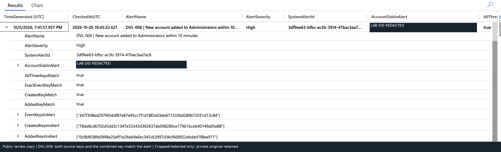
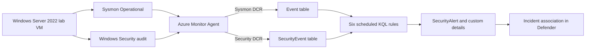

# Microsoft Sentinel Detection Validation Lab

**Six KQL detections. Twelve controlled case types. Alerts traced back to their source evidence.**

I built an Azure-hosted Windows lab to answer a practical question: **can I show that the alert belongs to the exact behavior I tested?** The project separates scenario execution, local telemetry, Azure ingestion, query matching and scheduled alert generation instead of treating a successful query as the end of validation.

The stack is **Windows Server 2022 · Sysmon · Windows Security auditing · Azure Monitor Agent · Log Analytics · Microsoft Sentinel · KQL · PowerShell · Python**.

This is an interview portfolio and controlled lab, not a production detection pack or a claim of measured detection accuracy.

## Start with the strongest example

[**New account → local Administrators → correlated alert → incident**](docs/case-study-account-chain.md)

DVL-006 correlates Windows Security **4720** and **4732** on the **same computer and account SID**, enforces a ten-minute sequence, and includes both source-event keys plus a combined key in the alert. The captured validation checks all three identifiers against the observed alert.

[](docs/case-study-account-chain.md)

## Architecture



The Sysmon path is normalized from XML. The Security path uses account/group fields directly. [Architecture and event-key design →](docs/architecture.md)

## Detection catalog

| Rule | Selected behavior | Negative/control example | Deployed KQL |
|---|---|---|---|
| DVL-001 | PowerShell `-enc` / `-EncodedCommand` invocation | Plain `-Command` | [Query](queries/deployed/DVL-001.kql) |
| DVL-002 | `schtasks.exe /Create` invocation | Lookup of an absent task with `/Query` | [Query](queries/deployed/DVL-002.kql) |
| DVL-003 | Account added to local Administrators (`S-1-5-32-544`) | Addition to Users (`S-1-5-32-545`) | [Query](queries/deployed/DVL-003.kql) |
| DVL-004 | Registry value set under the selected `CurrentVersion\Run` path | Write under `Software\DVL\Settings` | [Query](queries/deployed/DVL-004.kql) |
| DVL-005 | `certutil.exe -decode` invocation | `certutil.exe -hashfile` | [Query](queries/deployed/DVL-005.kql) |
| DVL-006 | New account added to Administrators within ten minutes | Account creation without that membership addition | [Query](queries/deployed/DVL-006.kql) |

## What was demonstrated

- **Six positive alerting paths**, with query-level negative/control examples that still produce visible source telemetry.
- **23 completed run manifests across 12 distinct case types**; repeated executions are not presented as unique scenarios.
- **137/137 file checksums matched** their supplied run reports in offline review; **38 local XML exports** parsed successfully.
- **16 Python unit tests passed offline**. These test validation-tool logic with fixtures, not the Sentinel scheduler or live KQL.

[Evidence gallery](docs/evidence/README.md) · [Verification and limitations](docs/validation.md) · [Troubleshooting](docs/troubleshooting.md)

## Engineering decisions worth inspecting

**Behavior, not only executable names.** Certutil's hash-only control should not match the decoding rule. The query-level controls make missing data distinguishable from a genuine non-match.

**Correct identity joins.** On 4720, the target SID is the new account. On 4732, the target SID is the group and the member SID is the added account. DVL-006 joins the account to itself, not to a group.

**Traceable event identifiers.** `EventKey` is a deterministic record identifier. For the account chain, the alert includes the two source keys and their composite. It is not a malware hash, an endpoint attestation or a deduplication guarantee.

**Diagnose before resetting.** An alert lookup failed because `EventID` was mapped instead of `EventKey`. Inspecting the alert's actual custom details identified the issue; a new test confirmed the enrichment correction. [Before/after evidence →](docs/troubleshooting.md)

## Repository layout

```text
queries/deployed/       Literal queries extracted from the final six-rule export
config/                Reusable rule template; rule properties preserved
lab/windows/           Patched PowerShell harness and auditing initializer
lab/config/            Sysmon configuration, DCR XPath notes, starter case catalog
lab/tools/             Read-only Azure validation helper
lab/tests/             Offline Python unit tests
lab/queries/           Starter/helper queries used by that helper (not the deployed authority)
docs/                  Architecture, case study, evidence and limitations
checks/                Recorded offline test results
```

The deployed queries and starter/helper queries are deliberately separate. The Azure-connected verifier was not run as a completed live validation campaign during the artifact review. Do not interpret its included source code or local tests as evidence of that campaign.

## Run the offline tests

Python 3.10 or later is needed for the included Python syntax. The unit tests use only the standard library and do not require Azure credentials.

```bash
cd lab
python3 -m unittest discover -s tests -v
```

The GitHub Actions workflow is configured for those offline tests. Its first GitHub-hosted result will only exist after publication; no prior successful CI run is claimed.

## Reproduce carefully

Read [the reproduction guide](docs/reproduction.md) **before executing any Windows script**. The scenarios temporarily modify accounts, group membership, scheduled tasks or registry values. Use an authorized disposable VM only. Cleanup is recorded, but it is not guaranteed if execution is interrupted; inspect failures before continuing. No downloaded malware is used, and the harmless task/Run-key actions must not be executed at startup/logon during the test.

## Scope and public evidence

The baseline intentionally retains five-minute scheduling, thirty-minute lookbacks and repeated alerts. No duplicate-alert reduction, completed scheduled negative coverage, incident closure, production readiness or false-positive rate is claimed. Entity mappings and descriptions remain as exported; no live resource was changed for this release.

Only selected, reviewed screenshots are public. Raw Windows logs, transcripts, manifests and the private interview bundle are excluded. The full private archive preserves the original evidence. Read the [publication/provenance note](docs/publication.md) for crop/redaction details and implementation provenance.

**Author:** Pete Andrews · [GitHub](https://github.com/PeteAndrews1289)
