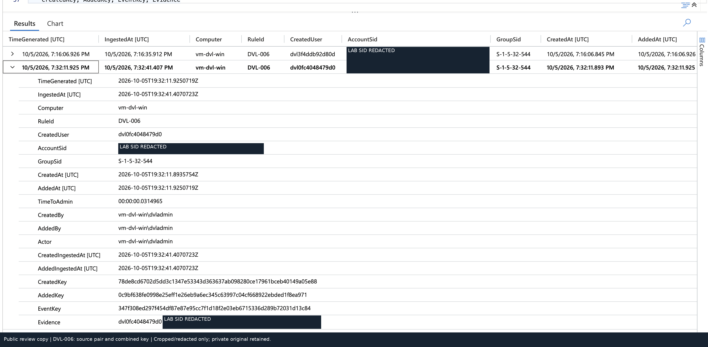
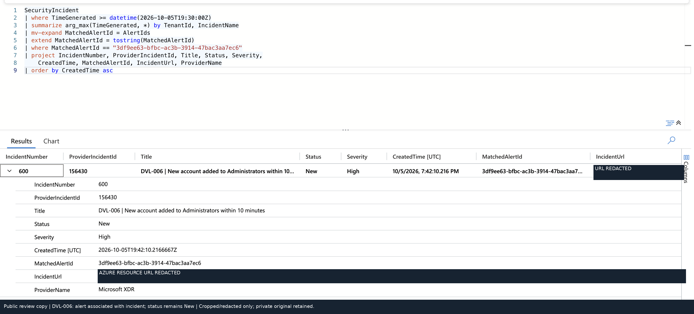

# Case study: a new account gains local Administrator membership

**Controlled lab exercise.** This is an evidence review, not a claim of a closed production incident.

## Objective

Identify a newly created account that is added to local Administrators on the same host within ten minutes, then link both source records to the generated alert and incident.

## Action and local evidence

The `chain_positive` scenario created a disabled disposable account with a random password, added it to local Administrators, verified the membership and ran cleanup. Scheduled example `0fc4048479d0` used account `dvl0fc4048479d0` on `vm-dvl-win`; its local account SID ended in `-1006`.

The private run export contains both Security 4720 and 4732. Its manifest reports successful execution/cleanup, and all six files listed by the original run's checksum report matched in offline review. Raw endpoint files are intentionally not public.

## Correlation logic

Creation `TargetSid` becomes `AccountSid`; membership `MemberSid` becomes `AccountSid`. The rule selects Administrators group SID `S-1-5-32-544`, joins on `Computer` and `AccountSid`, and checks event order and the ten-minute interval. The two acting accounts need not be identical.

[Full deployed DVL-006 query](../queries/deployed/DVL-006.kql)

| Observation | Recorded value |
|---|---|
| Account created | `2026-10-05T19:32:11.8935754Z` |
| Added to Administrators | `2026-10-05T19:32:11.9250719Z` |
| Difference | `00:00:00.0314965` |
| Creation key | `78de8cd6702d5dd3c1347e53343d363637ab098280ce17961bceb40149a05e88` |
| Addition key | `0c9bf638fe0998e25eff1e26eb9a6ec345c63997c04cf668922ebded1f8ea971` |
| Composite EventKey | `347f308ed297f454df87e87e95cc7f1d18f2e03eb6715336d289b72031d13c84` |

## Exact-key alert verification

The observed alert contains all three expected keys. This distinguishes the scheduled test from an older development account whose events were still inside the lookback.

The alert's `SystemAlertId` is `3df9ee63-bfbc-ac3b-3914-47bac3aa7ec6`. The incident query associates it with Sentinel incident 600 / provider incident 156430. Its recorded status is **New**, not resolved.

## Control and limits

The creation-only control has a completed manifest and captured creation telemetry without an Administrators addition in that captured selection. The original screenshot was taken before its ten-minute window elapsed; it is not counted as completed scheduled negative coverage.

The same membership event can also match DVL-003. That is expected overlap, not another attack. The test does not establish account enablement, interactive logon, use of the new privileges or malicious intent. No deduplication improvement or incident closure is claimed.

Public images are cropped/redacted copies. The SID's machine-specific portion and the Azure resource URL are withheld; original event keys and observed result values are retained. [Image provenance](evidence/image-provenance.json)
