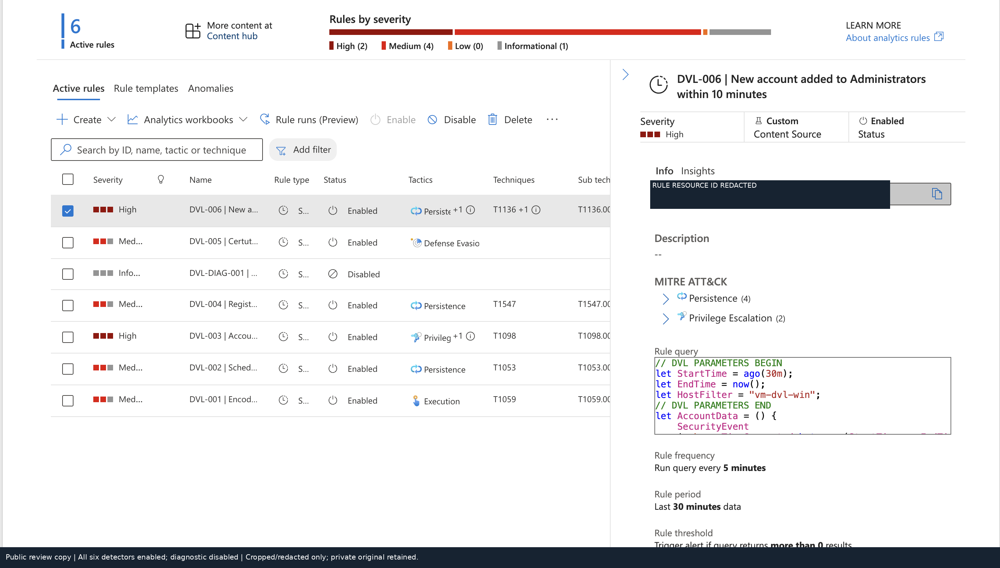
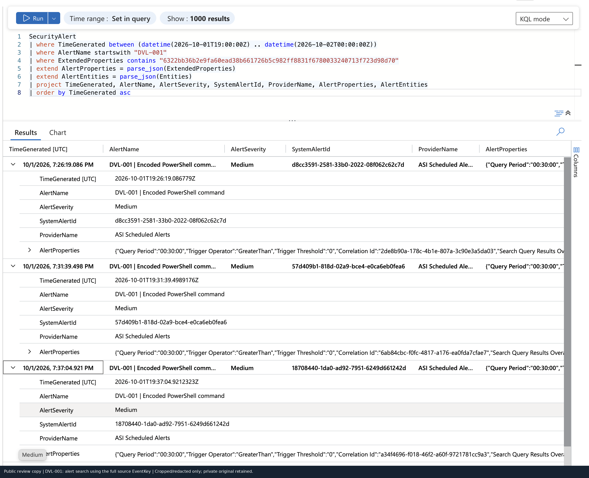
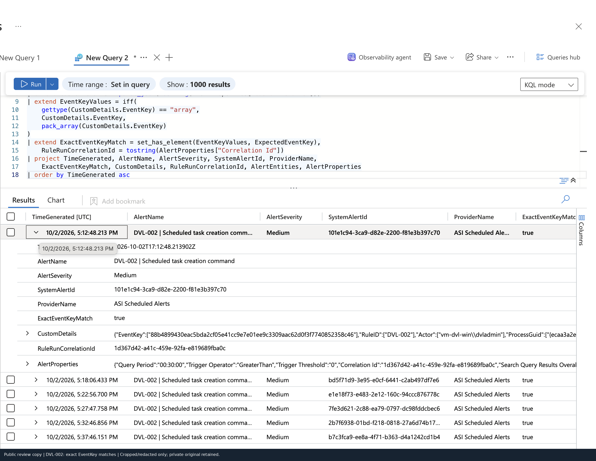
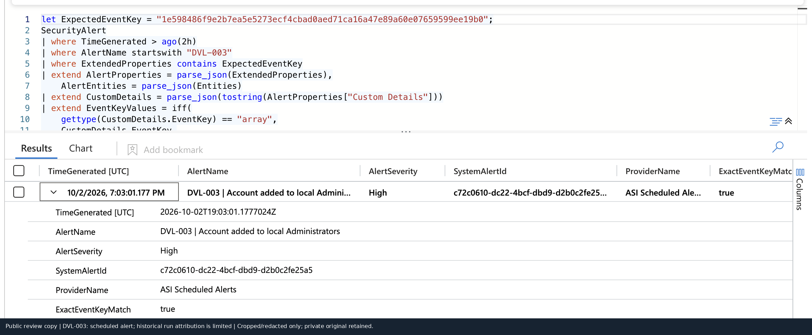
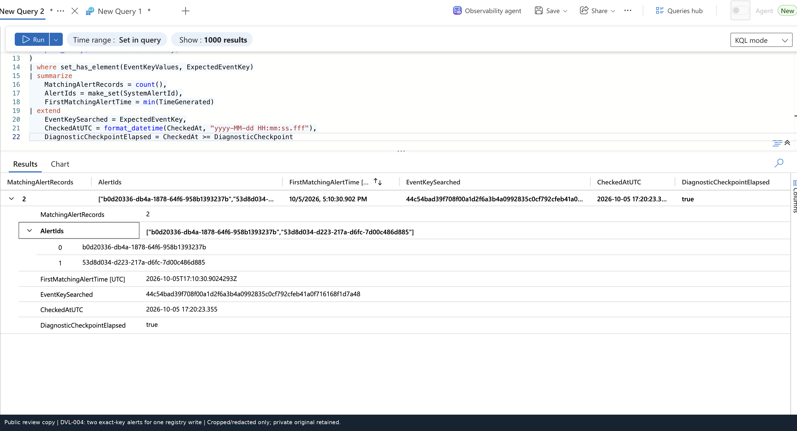

# Evidence gallery

Selected public review copies. Click an image to inspect it at full resolution. Crops/redactions are documented in [image-provenance.json](image-provenance.json). Raw originals remain private.

## All six detectors enabled; diagnostic disabled

## DVL-001: alert search using the full source EventKey

## DVL-002: exact EventKey matches

## DVL-003: scheduled alert; historical run attribution is limited

This is genuine scheduled alert evidence; the historical matching run lacks a completed manifest. It is not paired with the separate development account.

## DVL-004: two exact-key alerts for one registry write

## DVL-005: hash-only control is present and evaluates false

## DVL-005: before correction, EventID is present but EventKey is absent

## DVL-005: new test alerts include the correct EventKey

## DVL-006: source pair and combined key

## DVL-006: both source keys and the combined key match the alert

## DVL-006: alert associated with incident; status remains New

The incident is associated with the alert and is shown as **New**. This is not evidence of investigation closure.
