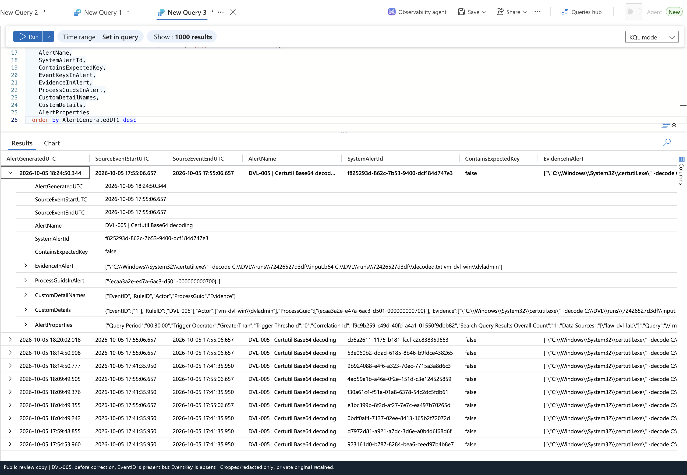
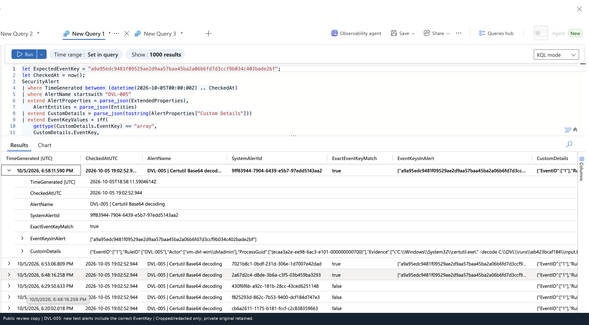
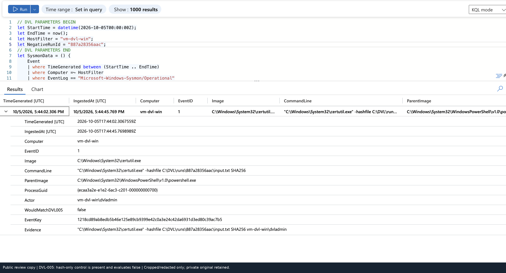

# Troubleshooting the evidence chain

## 1. An alert was present, but the exact-key search found nothing

DVL-005's scheduled Certutil rule was already producing alerts for the correct `-decode` test. The custom details contained `EventID: 1` but no `EventKey`. A query requiring the expected 64-character key could therefore not return those alerts.

The investigation compared the command paths/run ID, source time and ProcessGuid rather than repeatedly resetting the detector. Inspecting the actual custom-detail field names identified the mapping error.

The fix added `EventKey → EventKey` without changing the detection query. A fresh test then produced alerts whose actual custom EventKey matched the source record. `EventID` remained useful context but did not substitute for the record identifier.

## 2. Same executable, different behavior

The hash-only control invokes `certutil.exe -hashfile`. Its event is visible and normalized but the selected `-decode` condition evaluates false. A missing source record would not be counted as a negative success.

## 3. A checksum report tried to hash itself

The initial harness streamed files into a checksum CSV in the directory it was enumerating. It attempted to hash the open output CSV. The current harness excludes that report and materializes the input-file list and hash rows before writing it.

The private review verified 137 recorded per-run file hashes. A matching checksum proves equality with that supplied checksum report, not authenticity from an independent authority.

## 4. Preserving existing registry entries

The registry cases originally used `New-Item -Force` on a destination key without testing its existence. The patched harness adds an existence guard before creating that key, rather than needlessly replacing an existing key. It removes the uniquely named test value during cleanup, not unrelated values.

## 5. Empty searches were not all detector failures

The lab encountered rolling time-window exclusions, ingestion delay, early alert searches, old-run comparisons and sparse health-query results. A temporary heartbeat rule generated an alert despite an empty health lookup. Missing health rows were therefore not accepted as proof of no execution.

Some earlier registry searches were empty before a later exact-key alert lookup succeeded. The evidence does **not** prove that a re-save or toggle fixed a scheduler fault. The diagnostic rule was subsequently disabled.

## 6. Alerts are not independent tests

The 5-minute frequency / 30-minute lookback can return the same event on multiple evaluations. The portfolio distinguishes run count, source-event count, correlated-pair count and alert IDs. Repeated alerts remain visible; no successful tuning or rate reduction is claimed.
